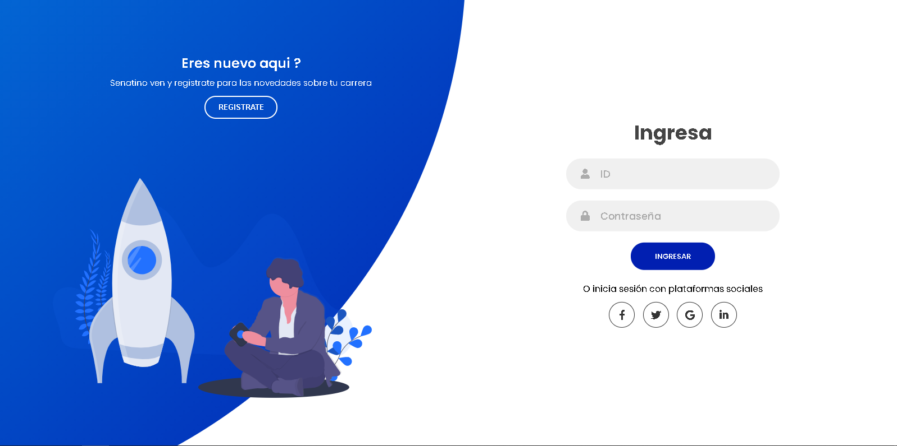

# Proyecto de Biblioteca Virtual

Plataforma web dedicada a la publicación de libros, proyectos y curriculums para los estudiantes de SENATI.

[Sitio web disponible](https://bibliotecavirtualsen.herokuapp.com/)

## Preview

## Construido con
* **HTML**
* **CSS**
* **JavaScript**
* **PHP**
* **Mysql**
* **jQuery**
* **Bootstrap**

-----------------------------------------

## Jefe de Proyecto

* **David Saavedra**

## Programador(Backend)

* **Jose Dulce**
* **Russell Alberto Chiclayo Alvarado**

## Base de Datos

* **Juan Ramirez**

## Analisis de Sistema

* **Vlady Gutierrez**

## Administrador de Sistemas

* **Vlady Gutierrez**

## Programador(Frontend)

* **Steew Andersson Chara Romero**
* **Manuel Alonso Colonio Camargo**
* **Isaac Israel Sanchez Villanueva**

## Tester

[Sistema orientado](https://senatipe.sharepoint.com/sites/innovacion/bv/SitePages/Home.aspx)
